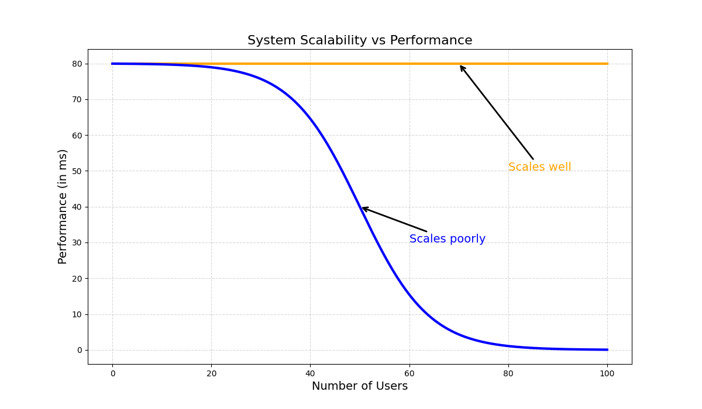

# Scalability V/S Performance

## Performace
Performance is the **umbrella** term.

It answers:
> “How well does the system behave under load?”

Performance includes:
- Latency (speed)
- Throughput (capacity)
- Resource usage (CPU, memory, network)
- Stability under load

📌 A system with:
- low latency
- high throughput
- stable under peak load

➡️ is called high-performance

## Scalbility

**Scalability = ability to maintain performance when load increases**
> “What happens when users go from 1k → 1M?”

**Types of scalability**
- Vertical scaling: Bigger machine
- Horizontal scaling: More machines (preferred)

**Scalability goal**
- Increase throughput
- Keep latency stable

📌 A system is scalable only if performance doesn’t degrade sharply as load grows.

In other words:
- If you have a performance problem, your system is slow for a single user.
- If you have a scalability problem, your system is fast for a single user but slow under heavy load.

---

---

# Resources
[Performance vs Scalability – Professor Beekums Blog](https://blog.professorbeekums.com/performance-vs-scalability/)
